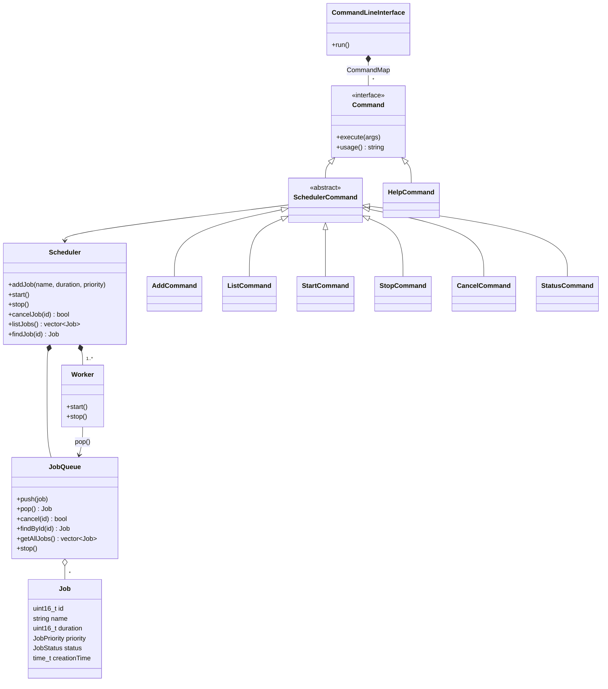

# Mini Job Scheduler

A lightweight command-line job scheduler implemented in modern C++.
Jobs are queued by priority and executed concurrently by a pool of worker threads.

## Features

- Priority-based job scheduling (`low`, `normal`, `high`)
- Multi-worker execution (2 worker threads by default)
- Thread-safe job queue
- Cancellation of pending jobs
- Job status tracking (`PENDING`, `RUNNING`, `COMPLETED`, `CANCELLED`)

## Requirements

- CMake 3.16+
- A C++14 compiler with GCC's libstdc++ or Clang's libc++ (Apple Clang works out of the box)

> **Note:** The project uses `std::experimental::propagate_const` from the Library
> Fundamentals TS v2. It isn't part of the C++ standard itself, so not every standard
> library provides it; libstdc++ and libc++ do.

## Build & Run

```bash
cmake -S . -B build
cmake --build build
./build/mini-job-scheduler
```

## Usage

| Command                             | Description                                     |
|-------------------------------------|-------------------------------------------------|
| `add <name> <duration> <priority>`  | Add a job. Duration is in seconds; priority is `low`, `normal` or `high` |
| `list`                              | List all jobs with their priority and status    |
| `start`                             | Start the worker threads                        |
| `stop`                              | Stop the workers                                |
| `cancel <id>`                       | Cancel a job that is still pending              |
| `status <id>`                       | Show a job's priority, status, duration and creation time |
| `help`                              | Show available commands                         |
| `quit`                              | Stop the scheduler and exit                     |

Example session:

```
=== Mini Job Scheduler CLI ===
Type 'help' for commands.

> add backup 3 high
Job backup added.
> add cleanup 2 low
Job cleanup added.
> start
Scheduler started with workers.

[Worker 1] Started Job 1 (backup)
[Worker 2] Started Job 2 (cleanup)
> list

ID    NAME           PRIORITY  STATUS
-------------------------------------------
1     backup         HIGH      RUNNING
2     cleanup        LOW       RUNNING
```

## Design

| Component              | Responsibility                                                        |
|------------------------|-----------------------------------------------------------------------|
| `Job`                  | Holds a job's id, name, duration, priority and status                 |
| `JobQueue`             | Thread-safe priority queue (`std::mutex` + `std::condition_variable`) |
| `Worker`               | Runs on its own `std::thread`, pops jobs from the queue and runs them |
| `Scheduler`            | Owns the queue and the workers; exposes add/start/stop/cancel         |
| `CommandLineInterface` | Reads input lines and runs the matching `Command`                     |
| `Command`              | One class per CLI command; `registerCommands` maps names to them      |

### Class diagram



### PIMPL

Every class uses the PIMPL (*pointer to implementation*) idiom: the public header only
declares the interface and a `d` pointer to a private `XxxPrivate` class, which is defined
in the `.cpp` file. This:

- keeps implementation details (mutexes, threads, containers) out of the public headers,
- reduces compile-time dependencies, since changing private members doesn't require
  recompiling the files that include the header,
- keeps the class layout stable.

The `d` pointer is wrapped in `std::experimental::propagate_const<std::unique_ptr<...>>`,
so `const` member functions can't modify the private data by accident.

## Technologies

- C++14 standard library (`std::thread`, `std::mutex`, `std::condition_variable`, `std::atomic`)
- PIMPL idiom
- Command pattern for dispatching CLI commands
- CMake
